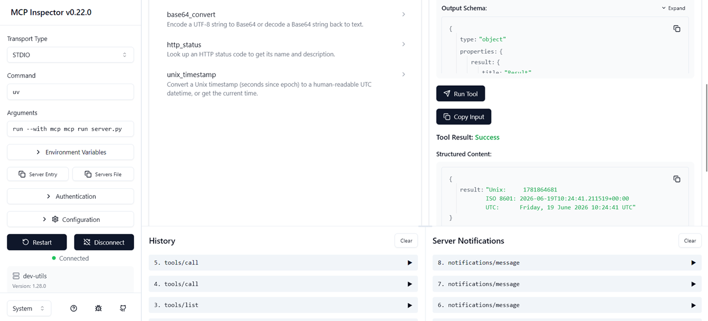

# mcp-dev-utils

A lightweight [Model Context Protocol](https://modelcontextprotocol.io/) server that exposes everyday developer utilities as MCP tools and resources.

Built with [`mcp`](https://github.com/modelcontextprotocol/python-sdk) — the official Python MCP SDK (uses `FastMCP` for a clean, decorator-based API).



---

## Tools

| Tool | Description |
|---|---|
| `format_json` | Pretty-print and validate a JSON string |
| `generate_uuid` | Generate 1–20 random UUID v4 values |
| `base64_convert` | Encode or decode Base64 strings |
| `http_status` | Look up an HTTP status code name and description |
| `unix_timestamp` | Convert a Unix timestamp to UTC or get the current time |

## Resources

| URI | Description |
|---|---|
| `utils://http-status-codes` | Full reference list of supported HTTP status codes |

---

## Running locally

**Requirements:** Python ≥ 3.11, `uv` (or `pip`)

```bash
# Install dependencies
uv sync

# Run over stdio (default — used by most MCP hosts)
uv run python server.py

# Or run as an SSE server on port 8000
uv run python -c "from server import mcp; mcp.run(transport='sse')"

# Test interactively in the browser
uv run mcp dev server.py
```

## Connecting to Claude Desktop

Add the following to your `claude_desktop_config.json`:

```json
{
  "mcpServers": {
    "dev-utils": {
      "command": "uv",
      "args": ["run", "python", "server.py"],
      "cwd": "/absolute/path/to/mcp-dev-utils"
    }
  }
}
```

On macOS the config lives at:
`~/Library/Application Support/Claude/claude_desktop_config.json`

On Windows the config lives at:
`%APPDATA%\Claude\claude_desktop_config.json`

---

## Project structure

```
mcp-dev-utils/
├── server.py        # All tools, resources, and server definition
├── test_client.py   # Example MCP client for manual testing
├── test_msg.txt     # Raw JSON-RPC messages (educational — use test_client.py for reliable testing)
├── pyproject.toml   # Project metadata and dependencies
└── README.md
```

## Key design decisions

- **Single-file server** — keeps the codebase easy to read and audit at a glance; ideal for a portfolio piece where clarity matters.
- **FastMCP** — the high-level SDK wrapper that removes boilerplate while still showing the underlying MCP concepts (tools, resources, structured arguments).
- **stdio transport** — the default and most universally supported transport; no extra infrastructure needed.
- **No external dependencies** — all tools rely only on the Python standard library plus `mcp` itself.